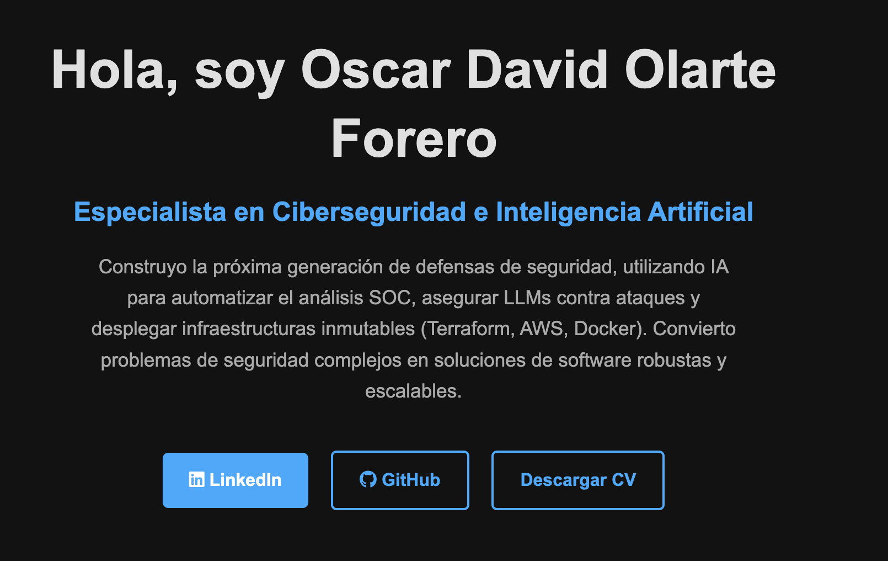

# Oscar David Olarte Forero | AI & Cybersecurity Specialist Portfolio

[](https://linkedin.com/in/oscar-david-olarte-forero-110292382)
[](https://github.com/osdaolfonabaco-beep)
[](https://osdaolfonabaco-beep.github.io)

---

## 🚀 Live Portfolio: [https://osdaolfonabaco-beep.github.io](https://osdaolfonabaco-beep.github.io)

This repository contains the source code for my professional portfolio website. This site serves as the central hub for my professional identity as an **AI & Cybersecurity Specialist**, built to showcase my enterprise-grade projects, technical capabilities, and professional CV to potential employers and collaborators.

<p align="center">
  
</p> 

## 🎯 About This Project

This portfolio is the "front door" to my body of work. It is built from scratch with clean, responsive, and semantic HTML & CSS, and hosted on GitHub Pages. The primary goal is to provide a clear, high-impact overview of my skills at the intersection of Cloud Engineering, AI, and Cybersecurity.

### 🛠️ Tech Stack (Portfolio)

* **`HTML5`**: Semantic markup, structured for accessibility and ATS-friendliness.
* **`CSS3`**: Custom properties, Flexbox, and Grid for a clean, modern, and responsive layout.
* **`JavaScript`**: Used minimally for future interactivity (e.g., mobile menu).
* **`GitHub Pages`**: Deployed and hosted directly from this repository.

## 📂 Featured Projects (Showcased on Site)

This portfolio highlights four key projects that demonstrate my ability to solve complex, expensive business problems.

1.  **"Superhuman" AI Security Gateway**
    * A production-grade, containerized (FastAPI/Docker) security proxy to protect enterprise LLMs from Prompt Injection attacks and PII data leakage (DLP).

2.  **Autonomous SOC Analyst Agent**
    * An AI agent that fully automates the Level 1 SOC Analyst workflow: ingesting AWS logs, detecting anomalies, enriching data via threat intel APIs, and generating incident reports with LangChain.

3.  **AWS Serverless Log Analyzer**
    * A 100% serverless security analysis pipeline deployed via **Terraform (IaC)**. Uses S3 events to trigger a Docker-based Lambda function for real-time log analysis.

4.  **LogSentinel Cloud Security Data Pipeline**
    * An end-to-end data engineering pipeline that ingests logs from AWS S3, enriches them against threat APIs, and persists the findings in an SQL database for historical analysis.

## 📄 Professional CV (Included)

This repository also contains the source code (`cv.html`, `cv-style.css`) for my professional CV. This HTML/CSS version was built to be 100% clean, ATS-compliant, and free of watermarks, and is downloadable from the main portfolio site.

* **[View the Live CV HTML](https://osdaolfonabaco-beep.github.io/cv.html)**
* **[Download the PDF Version](https://osdaolfonabaco-beep.github.io/CV-Oscar-Olarte.pdf)**

## 💻 How to Run Locally

1.  Clone this repository:
    ```bash
    git clone [https://github.com/osdaolfonabaco-beep/osdaolfonabaco-beep.github.io.git](https://github.com/osdaolfonabaco-beep/osdaolfonabaco-beep.github.io.git)
    ```
2.  Navigate to the directory:
    ```bash
    cd osdaolfonabaco-beep.github.io
    ```
3.  Open `index.html` or `cv.html` in your local browser.

## Connect With Me

Thank you for visiting. I am actively seeking remote opportunities and would be thrilled to discuss how my skills can bring value to your team.

* **LinkedIn:** [linkedin.com/in/oscar-david-olarte-forero-110292382](https://linkedin.com/in/oscar-david-olarte-forero-110292382)
* **Email:** `osdaolfonabaco@gmail.com`